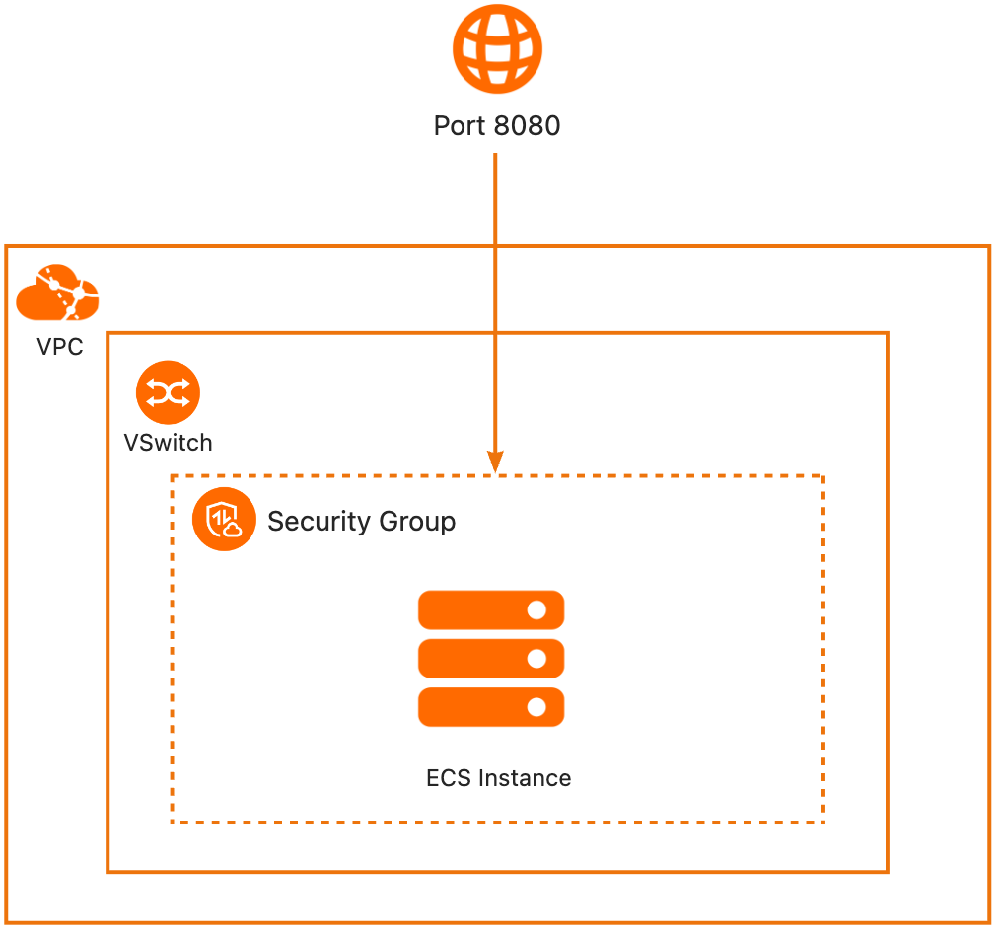
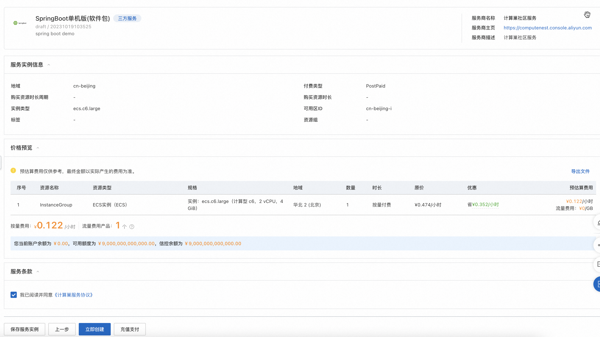
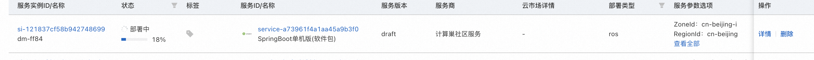

# 服务模板说明文档

## 服务说明

本文介绍基于SpringBoot+软件包的单机ecs服务快速上手流程，本示例对应的Git仓库地址：[springboot-ecs-package-demo](https://github.com/aliyun-computenest/springboot-ecs-package-demo)。

本示例会自动的构建计算巢服务，具体的服务构建流程为：
1. 上传文件并构建计算巢文件部署物。
2. 创建计算巢服务并关联文件部署物。

创建过程大约持续1分钟，当服务变成待提交后构建成功。

## 服务架构

本部署架构为单机ecs部署，通过公网ip 8080端口访问。


## 服务构建计费说明

测试本服务构建无需任何费用，创建服务实例涉及的费用参考服务实例计费说明。

## 服务实例计费说明

测试本服务在计算巢上的费用主要涉及：

- 所选vCPU与内存规格
- 系统盘类型及容量
- 公网带宽

计费方式包括：

- 按量付费（小时）
- 包年包月

预估费用在创建实例时可实时看到。


## 服务实例部署流程

### 部署步骤

0. 部署链接
 
1. 单击部署链接，进入服务实例部署界面，根据界面提示，填写参数完成部署。
 
2. 参数填写完成后可以看到对应询价明细，确认参数后点击**下一步：确认订单**。
 
3. 确认订单完成后同意服务协议并点击**立即创建**
   进入部署阶段。
    
   
    
4. 等待部署完成后就可以开始使用服务，进入服务实例详情点击visitUrl。
    
5. 部署结果
    


## 服务详细说明

本文通过将[代码](https://atomgit.com/flow-example/spring-boot)构建后，将deploy.sh和application.jar打包成package.tgz，通过计算巢部署物上传为文件部署物，并分发生成SpringBootPackage，然后在模板中ALIYUN::ECS::RunCommand执行命令。
```
yum install -y java
mkdir -p /home/admin/application
cd /home/admin/application
wget '{{ computenest::file::springboot }}' -O package.tgz
tar xvf package.tgz
/bin/bash deploy.sh start
```
{{ computenest::file::springboot }} 为占位符，会由计算巢服务替换成文件部署物SpringBootPackage的http下载地址。

templates/template.yaml主要由以下三部分组成：

1. Parameters定义需要用户填写的参数，包括付费类型，实例规格和实例密码可用区参数。
2. Resources定义需要开的资源，包括新开的vpc, vswitch和ecs实例, 以及执行命令的定义。
3. Outputs定义需要最终在计算巢概览页中对用户展示的输出

## 服务配置

[创建代运维服务完成实例运维](https://help.aliyun.com/zh/compute-nest/create-a-hosted-operations-and-maintenance-service?spm=a2c4g.11186623.0.i24#task-2167552])

[创建包含变配功能的服务](https://help.aliyun.com/zh/compute-nest/use-cases/create-a-service-that-supports-specification-changes-and-change-the-specifications-of-a-service-instance?spm=a2c4g.11186623.0.i3])

[创建包含服务升级功能的服务](https://help.aliyun.com/zh/compute-nest/upgrade-a-service-instance?spm=a2c4g.11186623.0.i17#task-2236803)

## 服务交付

[自定义服务架构图](https://help.aliyun.com/zh/compute-nest/customize-a-service-architecture?spm=a2c4g.11186623.0.0.56e736bfyUdlFm])

[服务文档上线流程](https://help.aliyun.com/zh/compute-nest/use-cases/publish-documents-to-compute-nest?spm=a2c4g.313309.0.i0])

[将服务上架云市场并上到云市场售卖](https://help.aliyun.com/zh/compute-nest/publish-a-service-to-alibaba-cloud-marketplace?spm=a2c4g.11186623.0.i7])

## 其他

[实例代码源地址](https://atomgit.com/flow-example/spring-boot)

[软件包package.tgz构建流程参考](https://help.aliyun.com/document_detail/153848.html)
